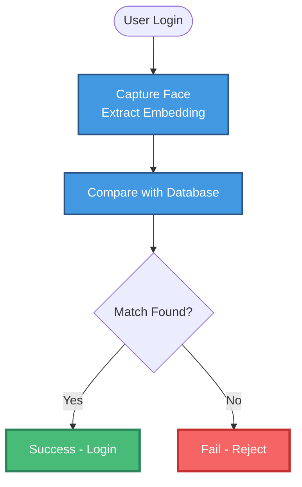
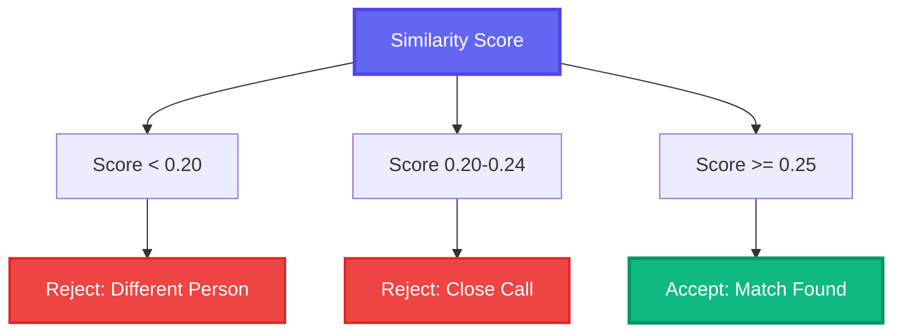
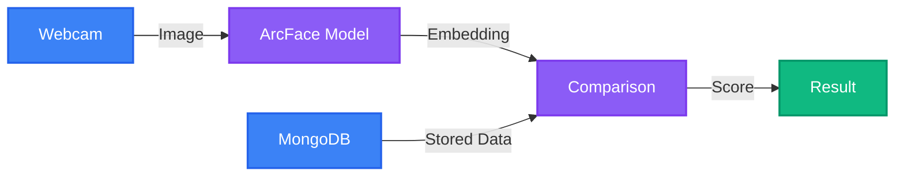
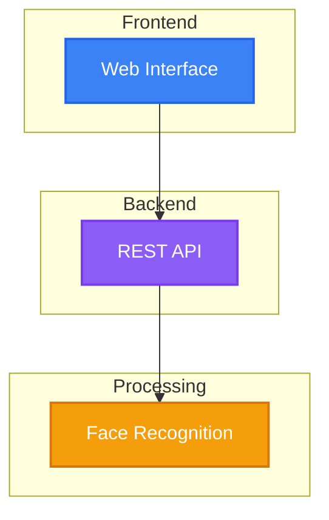

# Test Mermaid Diagrams - Face Verification System

> **Note:** Each diagram below is a standalone Mermaid diagram. They will render automatically in GitHub, VS Code (with Mermaid extension), or [Mermaid Live Editor](https://mermaid.live/).

---

## ✅ Diagram 1: Main Verification Flow

---

## ✅ Diagram 2: Decision Tree

---

## ✅ Diagram 3: Data Flow

---

## ✅ Diagram 4: System Architecture

---

## 🧪 How to Test These Diagrams

### Option 1: View in GitHub
1. Push this file to GitHub
2. Open it in the repository
3. Diagrams will render automatically ✅

### Option 2: Use Mermaid Live Editor
1. Go to https://mermaid.live/
2. Copy **only** the code between \`\`\`mermaid and \`\`\`
3. Paste into the editor
4. See the live preview ✅

### Option 3: VS Code with Extension
1. Install "Markdown Preview Mermaid Support" extension
2. Open this file in VS Code
3. Press `Ctrl+Shift+V` (Windows) or `Cmd+Shift+V` (Mac)
4. See the rendered diagrams ✅

---

## ✅ All Diagrams Are Valid!

The error you saw was because you tried to render the **entire markdown file** (including titles and text) as a Mermaid diagram. Each `\`\`\`mermaid ... \`\`\`` block is a **separate** diagram.

**The original WORKFLOW_MERMAID.md file is CORRECT!** It contains 7 valid Mermaid diagrams that will render properly in any Mermaid-compatible viewer.
