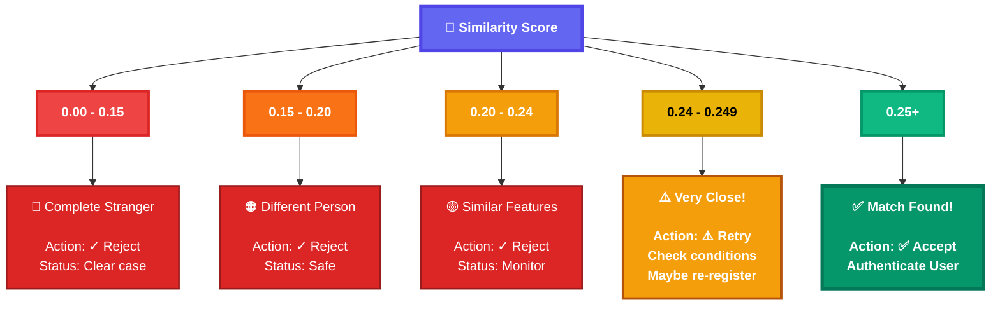
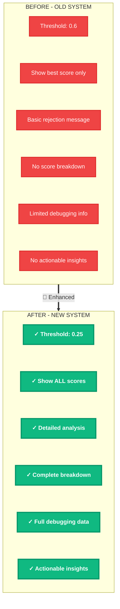

# Face Verification Workflow - Mermaid Diagram

## Main Verification Flow

```mermaid
flowchart TD
    Start([👤 User Attempts to Login]):::userNode
    Capture[📷 Capture Face from Webcam<br/>Extract Face Embedding<br/>🧠 ArcFace Model]:::captureNode
    StartComp{{🔄 Start Comparison Process}}:::processNode
    
    LoopProcess[🔁 For Each Registered User:<br/><br/>1️⃣ Load stored embedding<br/>2️⃣ Calculate cosine similarity<br/>3️⃣ Store username, similarity_score 🆕<br/>4️⃣ Print User 'name': Similarity = X.XXXX<br/>5️⃣ Track best_similarity and best_match]:::loopNode
    
    Decision{🎯 All Users Compared?<br/>Threshold = 0.25 🆕}:::decisionNode
    
    MatchCheck{⚖️ best_similarity > 0.25?}:::checkNode
    NoMatchCheck{⚖️ best_similarity ≤ 0.25?}:::checkNode
    
    MatchFound[✅ MATCH FOUND<br/>User Authenticated]:::successNode
    NoMatchFound[❌ NO MATCH FOUND<br/>Rejection Process]:::failNode
    
    EnhancedLog[🆕 Enhanced Logging:<br/><br/>1️⃣ Sort all scores high→low<br/>2️⃣ Print rejection header<br/>3️⃣ Show threshold 0.25<br/>4️⃣ Show best similarity<br/>5️⃣ Show gap from threshold<br/>6️⃣ Display ALL user scores<br/>7️⃣ Show pass/fail status<br/>8️⃣ Identify closest match]:::enhancedNode
    
    TerminalSuccess[🖥️ Terminal Output:<br/><br/>✅ SUCCESSFUL!<br/>User 'john_doe' verified<br/>Similarity: 0.5847]:::terminalSuccess
    
    TerminalFail[🖥️ Terminal Output:<br/><br/>❌ MATCH NOT FOUND!<br/>🔴 Threshold: 0.25<br/>🔴 Best: 0.1847<br/>🔴 Gap: 0.0653<br/><br/>📊 All Scores:<br/>1. john | 0.1847 | ✗<br/>2. jane | 0.1523 | ✗<br/>3. bob | 0.1289 | ✗<br/>═══════════════<br/>🔴 Closest: 'john']:::terminalFail
    
    JSONSuccess[📄 JSON Response:<br/><br/>success: true<br/>username: john_doe<br/>similarity: 0.5847]:::jsonSuccess
    
    JSONFail[📄 JSON Response:<br/><br/>success: false<br/>message: Not found<br/>similarity: 0.1847<br/>threshold: 0.25 🆕<br/>all_scores: [...] 🆕]:::jsonFail
    
    FrontendSuccess[🌐 Frontend:<br/><br/>Display: Welcome back,<br/>john_doe!<br/>Show: User Dashboard]:::frontendSuccess
    
    FrontendFail[🌐 Frontend:<br/><br/>Display: Face not<br/>recognized<br/>Action: Retry or Register]:::frontendFail
    
    Start --> Capture
    Capture --> StartComp
    StartComp --> LoopProcess
    LoopProcess --> Decision
    Decision --> MatchCheck
    Decision --> NoMatchCheck
    
    MatchCheck -->|Yes| MatchFound
    NoMatchCheck -->|Yes| NoMatchFound
    
    MatchFound --> TerminalSuccess
    NoMatchFound --> EnhancedLog
    EnhancedLog --> TerminalFail
    
    TerminalSuccess --> JSONSuccess
    TerminalFail --> JSONFail
    
    JSONSuccess --> FrontendSuccess
    JSONFail --> FrontendFail
    
    %% Styling
    classDef userNode fill:#667EEA,stroke:#4C51BF,stroke-width:3px,color:#fff,font-weight:bold
    classDef captureNode fill:#4299E1,stroke:#2C5282,stroke-width:3px,color:#fff,font-weight:bold
    classDef processNode fill:#48BB78,stroke:#2F855A,stroke-width:3px,color:#fff,font-weight:bold
    classDef loopNode fill:#9F7AEA,stroke:#6B46C1,stroke-width:3px,color:#fff,font-weight:bold
    classDef decisionNode fill:#ED8936,stroke:#C05621,stroke-width:3px,color:#fff,font-weight:bold
    classDef checkNode fill:#F6AD55,stroke:#DD6B20,stroke-width:3px,color:#fff,font-weight:bold
    classDef successNode fill:#48BB78,stroke:#2F855A,stroke-width:4px,color:#fff,font-weight:bold,box-shadow:0 4px 6px rgba(72,187,120,0.4)
    classDef failNode fill:#F56565,stroke:#C53030,stroke-width:4px,color:#fff,font-weight:bold,box-shadow:0 4px 6px rgba(245,101,101,0.4)
    classDef enhancedNode fill:#805AD5,stroke:#553C9A,stroke-width:3px,color:#fff,font-weight:bold
    classDef terminalSuccess fill:#38B2AC,stroke:#234E52,stroke-width:2px,color:#fff
    classDef terminalFail fill:#E53E3E,stroke:#9B2C2C,stroke-width:2px,color:#fff
    classDef jsonSuccess fill:#319795,stroke:#1D4044,stroke-width:2px,color:#fff
    classDef jsonFail fill:#E53E3E,stroke:#742A2A,stroke-width:2px,color:#fff
    classDef frontendSuccess fill:#38A169,stroke:#22543D,stroke-width:2px,color:#fff
    classDef frontendFail fill:#E53E3E,stroke:#742A2A,stroke-width:2px,color:#fff
```

## Comparison Algorithm Flow

```mermaid
flowchart TB
    Input[📥 Input:<br/>• test_embedding 512-dim vector<br/>• stored_embeddings list<br/>• threshold = 0.25]:::inputNode
    
    Init[🎬 Initialize:<br/>similarity_scores = [] 🆕<br/>best_similarity = 0<br/>best_match = None]:::initNode
    
    Loop{🔄 For Each User<br/>in Database}:::loopNode
    
    LoadEmbed[📂 Load stored_embedding<br/>from user.embedding]:::loadNode
    
    CalcSim[🧮 Calculate Cosine Similarity:<br/><br/>similarity = dot test, stored /<br/>‖test‖ * ‖stored‖]:::calcNode
    
    StoreScore[💾 Store Result 🆕:<br/><br/>similarity_scores.append<br/>username: user.username<br/>similarity: similarity]:::storeNode
    
    TrackBest{🎯 similarity ><br/>best_similarity?}:::trackNode
    
    UpdateBest[✏️ Update:<br/>best_similarity = similarity<br/>if similarity > threshold:<br/>best_match = user]:::updateNode
    
    Continue[➡️ Continue to Next User]:::continueNode
    
    Sort[🔀 Sort Scores 🆕:<br/>similarity_scores.sort<br/>reverse=True]:::sortNode
    
    CheckMatch{✅ best_match<br/>exists?}:::checkNode
    
    ReturnSuccess[🎉 Return SUCCESS:<br/>best_match<br/>best_similarity]:::successNode
    
    DisplayReject[📊 Display Rejection Details 🆕:<br/><br/>• Show all similarity_scores<br/>• Show best_similarity<br/>• Show threshold<br/>• Show gap from threshold]:::rejectNode
    
    ReturnFail[❌ Return FAILURE:<br/>similarity_scores 🆕]:::failNode
    
    Input --> Init
    Init --> Loop
    Loop -->|Yes| LoadEmbed
    LoadEmbed --> CalcSim
    CalcSim --> StoreScore
    StoreScore --> TrackBest
    TrackBest -->|Yes| UpdateBest
    TrackBest -->|No| Continue
    UpdateBest --> Continue
    Continue --> Loop
    Loop -->|No - All Done| Sort
    Sort --> CheckMatch
    CheckMatch -->|Yes| ReturnSuccess
    CheckMatch -->|No| DisplayReject
    DisplayReject --> ReturnFail
    
    %% Styling
    classDef inputNode fill:#667EEA,stroke:#5A67D8,stroke-width:3px,color:#fff,font-weight:bold
    classDef initNode fill:#4299E1,stroke:#3182CE,stroke-width:3px,color:#fff,font-weight:bold
    classDef loopNode fill:#9F7AEA,stroke:#805AD5,stroke-width:4px,color:#fff,font-weight:bold
    classDef loadNode fill:#48BB78,stroke:#38A169,stroke-width:2px,color:#fff
    classDef calcNode fill:#ED8936,stroke:#DD6B20,stroke-width:3px,color:#fff,font-weight:bold
    classDef storeNode fill:#805AD5,stroke:#6B46C1,stroke-width:3px,color:#fff,font-weight:bold
    classDef trackNode fill:#F6AD55,stroke:#ED8936,stroke-width:3px,color:#fff,font-weight:bold
    classDef updateNode fill:#4299E1,stroke:#2B6CB0,stroke-width:2px,color:#fff
    classDef continueNode fill:#A0AEC0,stroke:#718096,stroke-width:2px,color:#fff
    classDef sortNode fill:#9F7AEA,stroke:#6B46C1,stroke-width:3px,color:#fff,font-weight:bold
    classDef checkNode fill:#F6AD55,stroke:#DD6B20,stroke-width:3px,color:#fff,font-weight:bold
    classDef successNode fill:#48BB78,stroke:#2F855A,stroke-width:4px,color:#fff,font-weight:bold
    classDef rejectNode fill:#805AD5,stroke:#553C9A,stroke-width:3px,color:#fff,font-weight:bold
    classDef failNode fill:#F56565,stroke:#C53030,stroke-width:4px,color:#fff,font-weight:bold
```

## Decision Tree with Score Ranges



## Data Flow Architecture

```mermaid
flowchart LR
    Webcam[📷 Webcam<br/>Capture]:::webcamNode
    ArcFace[🧠 ArcFace<br/>Model]:::modelNode
    MongoDB[(🗄️ MongoDB<br/>Stored Data)]:::dbNode
    CosineSim[📐 Cosine<br/>Similarity]:::calcNode
    Score[📊 Score<br/>0.0-1.0]:::scoreNode
    Store[💾 Store in<br/>scores[] 🆕]:::storeNode
    Sort[🔀 Sort &<br/>Display 🆕]:::sortNode
    Terminal[🖥️ Terminal<br/>Output]:::terminalNode
    
    TestEmbed[Test<br/>Embedding<br/>512-dim]:::embedNode
    StoredEmbed[Stored<br/>Embedding<br/>512-dim]:::embedNode
    
    Webcam -->|Image| ArcFace
    ArcFace -->|Extract| TestEmbed
    MongoDB -->|Load| StoredEmbed
    TestEmbed -->|Compare| CosineSim
    StoredEmbed -->|Compare| CosineSim
    CosineSim -->|Calculate| Score
    Score -->|Save| Store
    Store -->|Process| Sort
    Sort -->|Display| Terminal
    
    %% Styling
    classDef webcamNode fill:#3B82F6,stroke:#2563EB,stroke-width:3px,color:#fff,font-weight:bold
    classDef modelNode fill:#8B5CF6,stroke:#7C3AED,stroke-width:3px,color:#fff,font-weight:bold
    classDef dbNode fill:#10B981,stroke:#059669,stroke-width:3px,color:#fff,font-weight:bold
    classDef calcNode fill:#F59E0B,stroke:#D97706,stroke-width:3px,color:#fff,font-weight:bold
    classDef scoreNode fill:#EC4899,stroke:#DB2777,stroke-width:3px,color:#fff,font-weight:bold
    classDef storeNode fill:#6366F1,stroke:#4F46E5,stroke-width:3px,color:#fff,font-weight:bold
    classDef sortNode fill:#8B5CF6,stroke:#7C3AED,stroke-width:3px,color:#fff,font-weight:bold
    classDef terminalNode fill:#06B6D4,stroke:#0891B2,stroke-width:3px,color:#fff,font-weight:bold
    classDef embedNode fill:#14B8A6,stroke:#0D9488,stroke-width:2px,color:#fff
```

## Key Improvements Comparison



## Enhanced Rejection Display Process

```mermaid
flowchart TD
    Start([🔴 Display Rejection Details]):::startNode
    
    Step1[1️⃣ Print Header:<br/>❌ MATCH NOT FOUND!]:::stepNode
    
    Step2[2️⃣ Print Threshold Info:<br/>🔴 Threshold: 0.25<br/>🔴 Best similarity: 0.1847<br/>🔴 Gap: 0.0653]:::stepNode
    
    Step3[3️⃣ Print Table Header:<br/>📊 All Similarity Scores<br/>sorted high to low<br/>═══════════════]:::stepNode
    
    Step4{4️⃣ For Each User<br/>in scores}:::loopNode
    
    Step5[Calculate:<br/>rank = index + 1<br/>status = ✓ PASS or ✗ FAIL]:::calcNode
    
    Step6[Print:<br/>rank. username | score | status]:::printNode
    
    Step7[5️⃣ Print Footer:<br/>═══════════════<br/>🔴 No user matched<br/>🔴 Closest match: username]:::stepNode
    
    End([✅ Display Complete]):::endNode
    
    Start --> Step1
    Step1 --> Step2
    Step2 --> Step3
    Step3 --> Step4
    Step4 -->|Has More| Step5
    Step5 --> Step6
    Step6 --> Step4
    Step4 -->|Done| Step7
    Step7 --> End
    
    %% Styling
    classDef startNode fill:#EC4899,stroke:#DB2777,stroke-width:4px,color:#fff,font-weight:bold
    classDef stepNode fill:#8B5CF6,stroke:#7C3AED,stroke-width:3px,color:#fff,font-weight:bold
    classDef loopNode fill:#F59E0B,stroke:#D97706,stroke-width:3px,color:#fff,font-weight:bold
    classDef calcNode fill:#3B82F6,stroke:#2563EB,stroke-width:2px,color:#fff
    classDef printNode fill:#06B6D4,stroke:#0891B2,stroke-width:2px,color:#fff
    classDef endNode fill:#10B981,stroke:#059669,stroke-width:4px,color:#fff,font-weight:bold
```

## System Architecture Overview

```mermaid
graph TB
    subgraph Frontend["Frontend Layer"]
        Web[Web Interface<br/>HTML/CSS/JS]:::frontendNode
        Webcam[Webcam API]:::frontendNode
    end
    
    subgraph Backend["Backend Layer - Flask"]
        API[REST API Endpoints]:::backendNode
        Verify[/api/verify_face NEW]:::apiNode
        Register[/api/register_face]:::apiNode
    end
    
    subgraph Processing["Processing Layer"]
        ArcFace[InsightFace ArcFace<br/>Buffalo_L Model]:::modelNode
        Detect[Face Detection]:::processNode
        Extract[Embedding Extraction<br/>512-dimensions]:::processNode
        Compare[Cosine Similarity<br/>Calculation]:::processNode
    end
    
    subgraph Storage["Storage Layer"]
        MongoDB[(MongoDB Database<br/>User Embeddings)]:::dbNode
    end
    
    subgraph Logging["Logging Layer NEW"]
        Terminal[Terminal Output<br/>All Similarity Scores]:::logNode
        JSON[JSON Response<br/>Enhanced Data]:::logNode
    end
    
    Web --> API
    Webcam --> API
    API --> Verify
    API --> Register
    Verify --> ArcFace
    Register --> ArcFace
    ArcFace --> Detect
    Detect --> Extract
    Extract --> Compare
    Compare --> MongoDB
    MongoDB --> Compare
    Compare --> Logging
    Terminal --> Web
    JSON --> Web
    
    %% Styling
    classDef frontendNode fill:#3B82F6,stroke:#2563EB,stroke-width:3px,color:#fff,font-weight:bold
    classDef backendNode fill:#8B5CF6,stroke:#7C3AED,stroke-width:3px,color:#fff,font-weight:bold
    classDef apiNode fill:#EC4899,stroke:#DB2777,stroke-width:2px,color:#fff
    classDef modelNode fill:#F59E0B,stroke:#D97706,stroke-width:3px,color:#fff,font-weight:bold
    classDef processNode fill:#06B6D4,stroke:#0891B2,stroke-width:2px,color:#fff
    classDef dbNode fill:#10B981,stroke:#059669,stroke-width:3px,color:#fff,font-weight:bold
    classDef logNode fill:#6366F1,stroke:#4F46E5,stroke-width:3px,color:#fff,font-weight:bold
```

---

## How to Use These Diagrams

1. **Copy the Mermaid code** from any section above
2. **Paste into**:
   - GitHub markdown files (renders automatically)
   - [Mermaid Live Editor](https://mermaid.live/)
   - VS Code with Mermaid extension
   - Documentation tools that support Mermaid

3. **Customize** colors and styles by modifying the `themeVariables` in the init block

## Features Included

- 🎨 **Beautiful color schemes** for each diagram type
- 📊 **Multiple diagram types**: flowchart, graph, decision trees
- 🔤 **Emoji icons** for visual appeal and quick recognition
- 🎯 **Custom styling** with different node shapes and colors
- 📝 **Clear labels** and descriptions
- 🆕 **Highlighted new features** with badges
- 🌈 **Color-coded** by function and importance
- 💡 **Easy to understand** flow and logic
